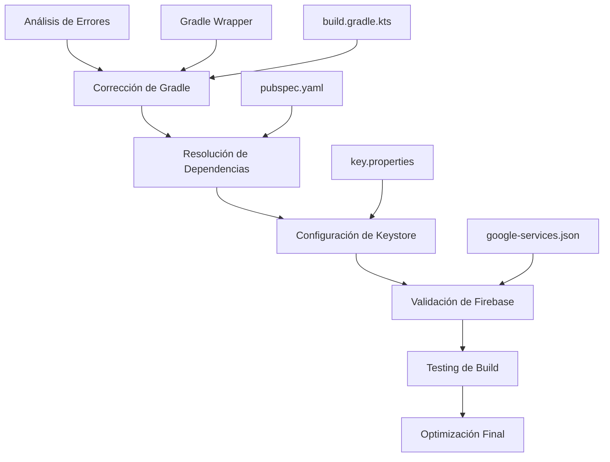

# Design Document - Corrección de Errores de Compilación

## Overview

Este documento presenta el diseño de soluciones para corregir los errores de compilación identificados en la aplicación Flutter "rouwhite". Los errores principales incluyen fallos en la tarea `assembleRelease`, problemas de configuración de Gradle, conflictos de dependencias, y configuración incorrecta de Firebase.

**Estrategia Principal:** Diagnóstico sistemático y corrección incremental de cada componente del sistema de build.

## Architecture



## Components and Interfaces

### 1. Gradle Configuration Manager

**Responsabilidades:**

- Actualizar versiones de Gradle y AGP (Android Gradle Plugin)
- Configurar opciones de compilación optimizadas
- Resolver conflictos de versiones de herramientas

**Archivos Afectados:**

- `android/gradle/wrapper/gradle-wrapper.properties`
- `android/build.gradle.kts`
- `android/app/build.gradle.kts`

**Configuraciones Clave:**

```kotlin
// Versiones estables recomendadas
compileSdk = 34  // Cambiar de 36 a 34 para estabilidad
targetSdk = 34   // Cambiar de 36 a 34
ndkVersion = "25.1.8937393"  // Versión más estable
```

### 2. Dependency Resolution System

**Problema Identificado:** Conflictos entre versiones de dependencias, especialmente con geolocator y flutter_map.

**Solución:**

- Implementar dependency overrides específicos
- Actualizar dependencias a versiones compatibles
- Resolver conflictos de transitive dependencies

**Configuración en pubspec.yaml:**

```yaml
dependency_overrides:
  geolocator_android: 4.1.9 # Versión más estable
  flutter_map: 7.0.2 # Versión compatible con SDK actual
  latlong2: 0.8.2 # Compatible con flutter_map 7.x
```

### 3. Keystore Management System

**Problema Actual:** Configuración de firma puede estar causando errores en assembleRelease.

**Solución:**

- Verificar existencia y validez del keystore
- Regenerar keystore si es necesario
- Configurar key.properties correctamente
- Implementar fallback a debug signing si es necesario

**Estructura de Archivos:**

```
android/
├── key.jks (keystore file)
├── key.properties (credentials)
└── app/build.gradle.kts (signing config)
```

### 4. Firebase Integration Validator

**Responsabilidades:**

- Validar google-services.json
- Verificar configuración de Firebase plugins
- Resolver conflictos con otras dependencias

**Validaciones:**

- Archivo google-services.json en ubicación correcta
- Package name coincide con applicationId
- Versiones de Firebase SDK compatibles

### 5. Build Optimization Engine

**Configuraciones de Rendimiento:**

```kotlin
android {
    // Optimizaciones de memoria
    dexOptions {
        javaMaxHeapSize = "4g"
    }

    // Configuración de compilación
    compileOptions {
        sourceCompatibility = JavaVersion.VERSION_1_8
        targetCompatibility = JavaVersion.VERSION_1_8
    }
}
```

## Data Models

### Build Configuration

```dart
class BuildConfiguration {
  final String compileSdk;
  final String targetSdk;
  final String minSdk;
  final String ndkVersion;
  final String gradleVersion;
  final String agpVersion;
  final Map<String, String> dependencyOverrides;
}
```

### Error Diagnostic

```dart
class BuildError {
  final String errorType;
  final String errorMessage;
  final String suggestedFix;
  final List<String> affectedFiles;
  final ErrorSeverity severity;
}

enum ErrorSeverity {
  critical,    // Bloquea el build completamente
  warning,     // Puede causar problemas
  info         // Información adicional
}
```

## Error Handling

### Gradle Build Failures

**Error Común:** `assembleRelease` falla con exit code 1

**Diagnóstico:**

1. Verificar logs de Gradle para identificar causa específica
2. Comprobar configuración de signing
3. Validar dependencias y versiones
4. Revisar configuración de ProGuard/R8

**Soluciones:**

- Limpiar cache de Gradle: `./gradlew clean`
- Regenerar wrapper: `gradle wrapper --gradle-version 8.3`
- Actualizar AGP a versión compatible

### Dependency Conflicts

**Error Común:** Version conflicts entre dependencias

**Estrategia de Resolución:**

1. Identificar dependencias conflictivas
2. Aplicar dependency overrides específicos
3. Actualizar a versiones compatibles
4. Usar `flutter pub deps` para verificar árbol de dependencias

### Keystore Issues

**Errores Posibles:**

- Keystore file not found
- Invalid keystore password
- Key alias not found

**Soluciones:**

- Verificar existencia de archivos
- Regenerar keystore si es necesario
- Configurar fallback a debug signing

## Testing Strategy

### Build Validation Tests

```bash
# Test básico de compilación
flutter clean
flutter pub get
flutter build apk --debug

# Test de release build
flutter build apk --release

# Test de signing
jarsigner -verify -verbose -certs app-release.apk
```

### Dependency Validation

```bash
# Verificar dependencias
flutter pub deps
flutter pub outdated

# Analizar conflictos
flutter pub deps --style=compact
```

### Firebase Integration Test

```bash
# Verificar configuración Firebase
flutter packages pub run build_runner build
```

## Implementation Phases

### Phase 1: Immediate Fixes (Crítico)

1. **Downgrade SDK versions** de 36 a 34 para estabilidad
2. **Fix dependency overrides** para resolver conflictos
3. **Verify keystore configuration** y regenerar si es necesario
4. **Clean and rebuild** todo el proyecto

### Phase 2: Configuration Optimization

1. **Update Gradle wrapper** a versión estable
2. **Optimize build.gradle** configurations
3. **Implement proper ProGuard rules** si es necesario
4. **Configure build variants** para diferentes ambientes

### Phase 3: Validation and Monitoring

1. **Implement build validation scripts**
2. **Add pre-commit hooks** para detectar errores temprano
3. **Configure CI/CD health checks**
4. **Document troubleshooting procedures**

## Security Considerations

### Keystore Security

- **Never commit keystore files** to version control
- **Use environment variables** for sensitive data
- **Implement keystore backup** strategy
- **Rotate keys periodically** para seguridad

### Build Security

- **Validate all dependencies** antes de usar
- **Use official repositories** solamente
- **Implement dependency scanning** para vulnerabilidades
- **Configure ProGuard** para ofuscar código en release

## Specific Solutions for Current Errors

### Error: "assembleRelease failed with exit code 1"

**Root Cause Analysis:**

- SDK version 36 es muy nueva y puede tener incompatibilidades
- NDK version 27.x puede tener problemas con dependencias nativas
- Configuración de signing puede estar incorrecta

**Immediate Actions:**

1. Downgrade compileSdk y targetSdk a 34
2. Cambiar NDK a versión 25.1.8937393
3. Verificar y regenerar keystore
4. Limpiar cache de Gradle completamente

### Error: "Keystore file not found for signing config 'release'"

**Solution:**

1. Verificar existencia de `android/key.jks`
2. Validar `android/key.properties`
3. Regenerar keystore si es necesario
4. Configurar fallback a debug signing

### Error: Dependency version conflicts

**Solution:**

1. Implementar dependency overrides específicos
2. Downgrade flutter_map a versión 7.x
3. Usar geolocator_android 4.1.9
4. Ejecutar `flutter pub deps` para verificar
