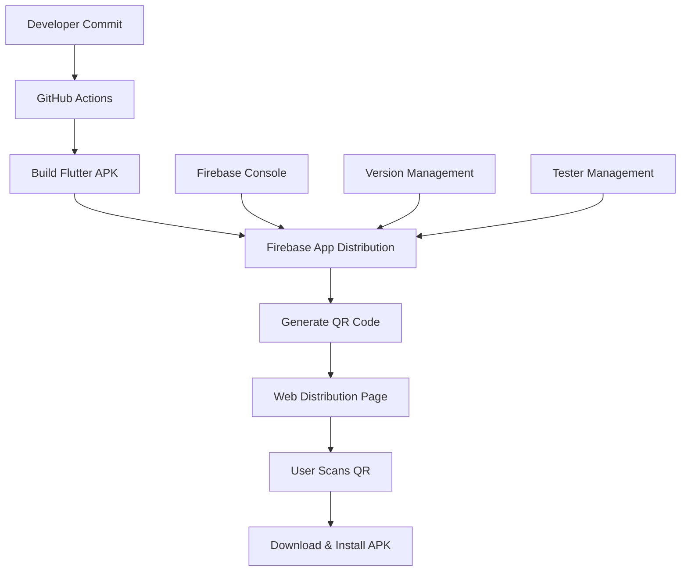

# Design Document - Sistema de Distribución con QR

## Overview

El sistema de distribución con QR permitirá automatizar la compilación, distribución y actualización de la aplicación Flutter "rouwhite" mediante un flujo de CI/CD que genere APKs automáticamente con cada commit y los haga disponibles a través de códigos QR.

**Arquitectura Recomendada:** Firebase App Distribution + GitHub Actions

Esta combinación ofrece:

- Integración nativa con Flutter
- Generación automática de QRs
- Distribución segura de APKs
- Notificaciones push para actualizaciones
- Gratuito hasta 100 testers

## Architecture



### Flujo de Distribución

1. **Trigger**: Commit en rama específica (main/develop)
2. **Build**: GitHub Actions compila el APK
3. **Upload**: APK se sube a Firebase App Distribution
4. **Notification**: Firebase genera QR y notifica testers
5. **Distribution**: Usuarios escanean QR y descargan APK

## Components and Interfaces

### 1. GitHub Actions Workflow

**Archivo**: `.github/workflows/build-and-distribute.yml`

**Responsabilidades:**

- Detectar commits en ramas específicas
- Configurar entorno Flutter
- Compilar APK con firma de release
- Subir APK a Firebase App Distribution
- Generar página web con QR actualizado

**Triggers:**

- Push a rama `main` (producción)
- Push a rama `develop` (desarrollo)
- Tags de versión (releases)

### 2. Firebase App Distribution

**Configuración:**

- Proyecto Firebase vinculado al repositorio
- Service Account con permisos de App Distribution
- Grupos de testers configurados por ambiente

**Funcionalidades:**

- Almacenamiento seguro de APKs
- Generación automática de enlaces de descarga
- Gestión de versiones y rollbacks
- Notificaciones push a testers registrados

### 3. Web Distribution Page

**Ubicación**: GitHub Pages o Firebase Hosting
**URL**: `https://[usuario].github.io/rouwhite/` o dominio personalizado

**Contenido:**

- QR code actualizado automáticamente
- Información de versión actual
- Instrucciones de instalación
- Enlaces directos de descarga
- Estado del último build

### 4. App Update Mechanism

**Implementación en Flutter:**

- Service para verificar nuevas versiones
- Dialog de actualización con enlace a distribución
- Persistencia de configuración de actualizaciones

## Data Models

### Build Information

```dart
class BuildInfo {
  final String version;
  final String buildNumber;
  final DateTime buildDate;
  final String commitHash;
  final String branch;
  final String downloadUrl;
  final String qrCodeUrl;
  final BuildStatus status;
}

enum BuildStatus {
  building,
  success,
  failed,
  distributing
}
```

### Distribution Config

```dart
class DistributionConfig {
  final String firebaseProjectId;
  final String appId;
  final List<String> testerGroups;
  final Map<String, String> branchEnvironments;
  final bool autoNotifyTesters;
}
```

### Update Check Response

```dart
class UpdateCheckResponse {
  final bool hasUpdate;
  final String latestVersion;
  final String downloadUrl;
  final String releaseNotes;
  final bool forceUpdate;
}
```

## Error Handling

### Build Failures

- **Detección**: GitHub Actions detecta errores de compilación
- **Notificación**: Webhook a Discord/Slack con detalles del error
- **Fallback**: Mantener versión anterior disponible
- **Logs**: Almacenar logs detallados en GitHub Actions

### Distribution Failures

- **Retry Logic**: Reintentar subida a Firebase hasta 3 veces
- **Alternative Storage**: Backup en GitHub Releases si Firebase falla
- **User Communication**: Mostrar mensaje de error en página de distribución

### Download/Installation Issues

- **Instrucciones Claras**: Guía paso a paso para habilitar fuentes desconocidas
- **Alternative Methods**: Enlaces directos además del QR
- **Support Contact**: Información de contacto para soporte técnico

## Testing Strategy

### Automated Testing

- **Unit Tests**: Servicios de actualización y verificación de versiones
- **Integration Tests**: Flujo completo de descarga e instalación
- **E2E Tests**: Verificar QR generation y página de distribución

### Manual Testing

- **Multi-device Testing**: Probar en diferentes dispositivos Android
- **Network Conditions**: Verificar descarga en diferentes velocidades
- **Permission Testing**: Validar instalación con diferentes configuraciones de seguridad

### Staging Environment

- **Separate Firebase Project**: Ambiente de pruebas independiente
- **Test Branch**: Rama `staging` para validar cambios antes de producción
- **Limited Testers**: Grupo reducido de testers internos

## Security Considerations

### APK Signing

- **Release Keystore**: Almacenar keystore de forma segura en GitHub Secrets
- **Key Management**: Rotar claves periódicamente
- **Signature Verification**: Validar firma antes de distribución

### Access Control

- **Tester Management**: Controlar acceso mediante grupos de Firebase
- **Environment Separation**: Diferentes proyectos Firebase por ambiente
- **Secret Management**: Usar GitHub Secrets para tokens y claves

### Distribution Security

- **HTTPS Only**: Todas las URLs de distribución deben usar HTTPS
- **Token Expiration**: Enlaces de descarga con expiración automática
- **Rate Limiting**: Limitar descargas por IP para prevenir abuso

## Implementation Phases

### Phase 1: Basic CI/CD Setup

- Configurar GitHub Actions para build automático
- Integrar Firebase App Distribution
- Crear página web básica con QR

### Phase 2: Enhanced Distribution

- Implementar múltiples ambientes
- Agregar notificaciones automáticas
- Mejorar página web con información detallada

### Phase 3: In-App Updates

- Implementar verificación de actualizaciones en la app
- Agregar notificaciones push para nuevas versiones
- Implementar analytics de distribución

### Phase 4: Advanced Features

- Rollback automático en caso de errores
- A/B testing para diferentes versiones
- Métricas avanzadas de adopción
