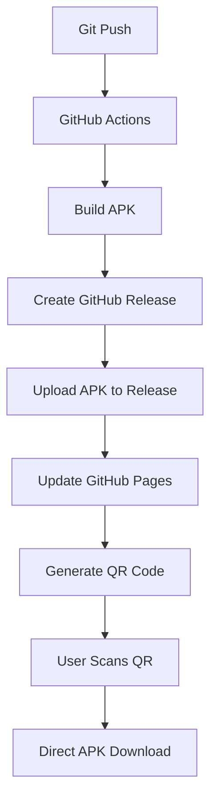

# Design Document - Distribución Simple con QR

## Overview

Esta solución utiliza **GitHub Releases + GitHub Pages** para crear un sistema de distribución automático y gratuito. Es mucho más simple que Firebase App Distribution y no requiere configuraciones complejas.

**Arquitectura:** GitHub Actions → GitHub Releases → GitHub Pages → QR Code

## Architecture



### Flujo Completo

1. **Developer Push**: Commit a rama main
2. **Auto Build**: GitHub Actions compila APK
3. **Auto Release**: Crea release con APK adjunto
4. **Auto Deploy**: Actualiza página web en GitHub Pages
5. **Auto QR**: Genera QR code apuntando al APK más reciente
6. **User Download**: Usuario escanea QR y descarga directamente

## Components and Interfaces

### 1. GitHub Actions Workflow

**Archivo**: `.github/workflows/build-and-release.yml`

**Responsabilidades:**

- Compilar APK automáticamente
- Crear GitHub Release con versionado automático
- Subir APK como asset del release
- Actualizar página de GitHub Pages

**Triggers:**

- Push a rama `main`
- Tags de versión (opcional)

**Configuración Clave:**

```yaml
name: Build and Release APK
on:
  push:
    branches: [main]
jobs:
  build:
    runs-on: ubuntu-latest
    steps:
      - uses: actions/checkout@v3
      - uses: actions/setup-java@v3
      - uses: subosito/flutter-action@v2
      - name: Build APK
        run: flutter build apk --release
      - name: Create Release
        uses: softprops/action-gh-release@v1
        with:
          files: build/app/outputs/flutter-apk/app-release.apk
          tag_name: v${{ github.run_number }}
          name: Release v${{ github.run_number }}
```

### 2. GitHub Pages Website

**Ubicación**: `docs/index.html` (o rama `gh-pages`)
**URL**: `https://[usuario].github.io/rutasapp/`

**Funcionalidades:**

- Página web responsive y simple
- QR code generado automáticamente
- Información de versión actual
- Instrucciones de instalación
- Enlaces directos de descarga

**Tecnologías:**

- HTML5 + CSS3 + JavaScript vanilla
- QR.js para generar códigos QR
- GitHub API para obtener último release

### 3. Automatic Versioning

**Sistema de Versionado:**

- Usa `github.run_number` para versionado automático
- Formato: `v1`, `v2`, `v3`, etc.
- Cada push genera nueva versión
- No requiere tags manuales

### 4. APK Distribution

**Almacenamiento:**

- APKs se almacenan como assets de GitHub Releases
- Descarga directa sin autenticación
- URLs estables y predecibles
- Historial completo de versiones

## Data Models

### Release Information

```javascript
// Estructura de datos del GitHub API
const releaseInfo = {
  tag_name: "v123",
  name: "Release v123",
  published_at: "2024-01-15T10:30:00Z",
  assets: [
    {
      name: "app-release.apk",
      download_count: 45,
      browser_download_url:
        "https://github.com/user/repo/releases/download/v123/app-release.apk",
    },
  ],
};
```

### Page Configuration

```javascript
const config = {
  repoOwner: "gerardoojeda47",
  repoName: "rutasapp",
  appName: "RouWhite - Rutas Popayán",
  appDescription: "Aplicación de rutas de transporte público en Popayán",
  appIcon: "assets/icon.png",
};
```

## Implementation Details

### 1. GitHub Pages Setup

**Configuración en Repository Settings:**

- Habilitar GitHub Pages
- Source: Deploy from a branch
- Branch: `main` / `docs` folder
- Custom domain (opcional)

### 2. Automatic QR Generation

**JavaScript para QR dinámico:**

```javascript
async function generateQR() {
  const latestRelease = await fetch(
    `https://api.github.com/repos/${owner}/${repo}/releases/latest`
  );
  const release = await latestRelease.json();
  const apkUrl = release.assets[0].browser_download_url;

  QRCode.toCanvas(document.getElementById("qr-canvas"), apkUrl, {
    width: 256,
    margin: 2,
  });
}
```

### 3. Version Management

**Automatic Increment:**

- Usa GitHub run number como versión
- No requiere modificar archivos manualmente
- Versionado consistente y automático

### 4. Download Analytics

**Tracking Simple:**

- GitHub proporciona download counts automáticamente
- Visible en la página de releases
- No requiere configuración adicional

## Error Handling

### Build Failures

**Estrategia:**

- Si el build falla, no se crea release
- Release anterior permanece disponible
- Logs detallados en GitHub Actions
- Notificaciones automáticas por email

### Download Issues

**Soluciones:**

- Enlaces directos como fallback
- Instrucciones para diferentes navegadores
- Guía para habilitar fuentes desconocidas
- Contacto de soporte

## Security Considerations

### APK Signing

**Configuración:**

- Usar GitHub Secrets para keystore
- Firmar APK en el workflow
- Verificar integridad del APK

### Access Control

**Configuración:**

- Releases públicos (no requiere autenticación)
- Repository puede ser privado
- Control de acceso a nivel de organización

## Advantages vs Firebase

| Aspecto            | GitHub Solution | Firebase App Distribution  |
| ------------------ | --------------- | -------------------------- |
| **Costo**          | 100% Gratuito   | Gratuito hasta 100 testers |
| **Configuración**  | Muy simple      | Compleja                   |
| **Dependencias**   | Solo GitHub     | Firebase + Service Account |
| **Mantenimiento**  | Mínimo          | Requiere gestión           |
| **URLs**           | Estables        | Pueden cambiar             |
| **Analytics**      | Básicos         | Avanzados                  |
| **Notificaciones** | No              | Sí                         |

## Implementation Phases

### Phase 1: Basic Setup (30 min)

1. Crear workflow de GitHub Actions
2. Configurar GitHub Pages
3. Crear página HTML básica
4. Probar primer release automático

### Phase 2: Enhanced Features (1 hora)

1. Agregar generación de QR dinámico
2. Mejorar diseño de la página
3. Agregar instrucciones de instalación
4. Implementar manejo de errores

### Phase 3: Polish (30 min)

1. Optimizar para móviles
2. Agregar analytics básicos
3. Mejorar UX/UI
4. Documentar proceso

**Tiempo Total Estimado: 2 horas**

## File Structure

```
.github/
  workflows/
    build-and-release.yml
docs/
  index.html
  style.css
  script.js
  assets/
    icon.png
    qr-placeholder.png
```

Esta solución es **mucho más simple** que Firebase y funciona perfectamente para distribución de APKs mediante QR codes.
