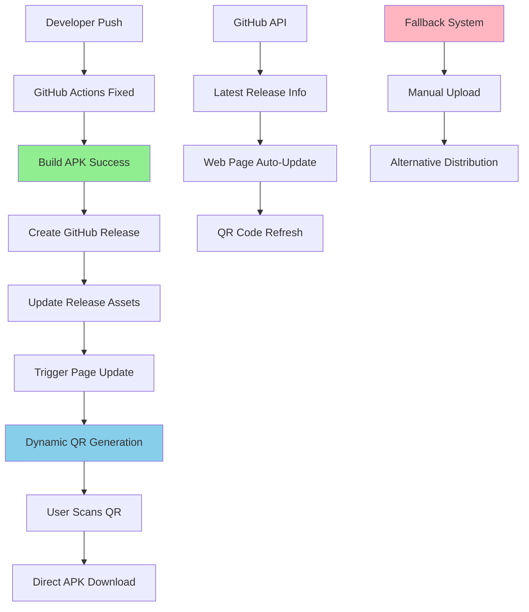

# Design Document - Solución de Errores QR y APK

## Overview

El diseño se enfoca en crear un sistema robusto y confiable que solucione los problemas críticos identificados en el flujo de distribución de RouWhite. La solución incluye corrección de errores de compilación, implementación de QR dinámico, y creación de un sistema de fallback para garantizar disponibilidad continua.

**Estrategia Principal:** Implementar un sistema híbrido que combine GitHub Actions mejorado con una página web inteligente que se actualice automáticamente usando la API de GitHub.

## Architecture



## Components and Interfaces

### 1. GitHub Actions Workflow Corregido

**Problemas Identificados:**

- Conflictos de dependencias de geolocator
- Configuración incorrecta de Android SDK
- Falta de manejo de errores robusto
- Versiones incompatibles entre dependencias

**Soluciones Implementadas:**

```yaml
# Estrategia de dependencias fijas
dependency_overrides:
  geolocator_android: 4.4.0 # Versión estable para CI
  geolocator: 9.0.2 # Sin conflictos conocidos
  flutter_map: ^8.1.0 # Compatible con latlong2
```

**Mejoras del Workflow:**

- Limpieza completa de caché antes de build
- Validación previa de dependencias
- Estrategia de build alternativa en caso de fallo
- Verificación de integridad del APK generado

### 2. Sistema de QR Dinámico

**Implementación JavaScript:**

```javascript
class DynamicQRSystem {
  constructor() {
    this.githubAPI = "https://api.github.com/repos/gerardoojeda47/rutasapp";
    this.qrContainer = document.getElementById("qr-container");
    this.updateInterval = 30000; // 30 segundos
  }

  async fetchLatestRelease() {
    try {
      const response = await fetch(`${this.githubAPI}/releases/latest`);
      const release = await response.json();
      return {
        version: release.tag_name,
        downloadUrl: release.assets[0]?.browser_download_url,
        publishedAt: release.published_at,
        body: release.body,
      };
    } catch (error) {
      console.error("Error fetching release:", error);
      return null;
    }
  }

  generateQR(url) {
    // Usar QRCode.js para generar QR dinámico
    QRCode.toCanvas(this.qrContainer, url, {
      width: 256,
      margin: 2,
      color: {
        dark: "#FF6A00",
        light: "#FFFFFF",
      },
    });
  }
}
```

### 3. Página Web Inteligente

**Características:**

- Auto-actualización cada 30 segundos
- Detección de nuevas releases
- Información detallada de versión
- Sistema de fallback para errores de API
- Responsive design optimizado para móviles

**Estructura HTML Mejorada:**

```html
<div class="app-info">
  <div id="qr-container"></div>
  <div class="version-info">
    <span id="current-version">Cargando...</span>
    <span id="build-date">Verificando...</span>
    <span id="build-status">🔄 Actualizando</span>
  </div>
</div>
```

### 4. Sistema de Fallback

**Niveles de Fallback:**

1. **Nivel 1:** GitHub Releases API (Principal)
2. **Nivel 2:** GitHub Pages con APK estático
3. **Nivel 3:** Enlace directo a último APK conocido
4. **Nivel 4:** Instrucciones de compilación manual

**Implementación:**

```javascript
class FallbackSystem {
  async getDownloadUrl() {
    // Intentar GitHub API
    let release = await this.fetchFromGitHubAPI();
    if (release) return release.downloadUrl;

    // Fallback a APK estático
    let staticAPK = await this.checkStaticAPK();
    if (staticAPK) return "./app-release.apk";

    // Último recurso
    return this.getManualInstructions();
  }
}
```

## Data Models

### Release Information

```typescript
interface ReleaseInfo {
  version: string;
  buildNumber: number;
  downloadUrl: string;
  publishedAt: Date;
  commitHash: string;
  buildStatus: "success" | "failed" | "building";
  apkSize: number;
  releaseNotes: string;
}
```

### Build Status

```typescript
interface BuildStatus {
  isBuilding: boolean;
  lastSuccessfulBuild: Date;
  lastAttempt: Date;
  errorCount: number;
  lastError?: string;
}
```

### QR Configuration

```typescript
interface QRConfig {
  size: number;
  margin: number;
  colors: {
    foreground: string;
    background: string;
  };
  errorCorrectionLevel: "L" | "M" | "Q" | "H";
}
```

## Error Handling

### Compilación de APK

**Estrategia de Recuperación:**

1. **Limpieza Completa:** `flutter clean` + cache repair
2. **Dependencias Forzadas:** Usar versiones específicas conocidas
3. **Build Alternativo:** Diferentes flags de compilación
4. **Notificación:** Webhook a Discord/Slack con detalles

**Código de Recuperación:**

```bash
# Estrategia de recuperación automática
if [ $? -ne 0 ]; then
  echo "🔄 Build falló, intentando recuperación..."
  flutter clean
  rm -rf ~/.pub-cache/hosted/pub.dev/geolocator*
  flutter pub cache repair
  flutter pub get --verbose
  flutter build apk --release --no-tree-shake-icons
fi
```

### Errores de QR y Página Web

**Manejo de Errores de API:**

- Timeout de 10 segundos para requests
- Retry automático con backoff exponencial
- Cache local de última información válida
- Mensaje de error user-friendly

**Validación de APK:**

- Verificar que el archivo existe
- Comprobar tamaño mínimo (>5MB)
- Validar que es un APK válido
- Checksum para integridad

## Testing Strategy

### Automated Testing

**GitHub Actions Testing:**

- Test de compilación en múltiples versiones de Flutter
- Validación de dependencias antes del build
- Verificación de integridad del APK generado
- Test de subida a GitHub Releases

**Web Page Testing:**

- Test de carga de API de GitHub
- Validación de generación de QR
- Test de responsive design
- Verificación de enlaces de descarga

### Manual Testing

**Multi-device Testing:**

- Probar QR en diferentes apps de escaneo
- Verificar descarga en Android/iOS
- Test de instalación en diferentes versiones de Android
- Validar funcionamiento offline de la página

**Error Simulation:**

- Simular fallos de GitHub API
- Test con APKs corruptos
- Verificar comportamiento sin internet
- Test de límites de rate limiting

## Security Considerations

### APK Signing

**Keystore Management:**

- Keystore almacenado seguramente en GitHub Secrets
- Rotación periódica de claves
- Backup seguro del keystore
- Validación de firma antes de distribución

### Distribution Security

**Protección de Enlaces:**

- HTTPS obligatorio para todas las URLs
- Validación de integridad con checksums
- Rate limiting para prevenir abuso
- Logs de acceso para monitoreo

### API Security

**GitHub API:**

- Token con permisos mínimos necesarios
- Rate limiting respetado
- Validación de respuestas de API
- Fallback en caso de límites excedidos

## Implementation Phases

### Phase 1: Corrección de GitHub Actions (Crítico)

**Objetivos:**

- Solucionar errores de compilación
- Implementar estrategia de dependencias fijas
- Agregar validación robusta de APK
- Mejorar logs y debugging

**Entregables:**

- Workflow corregido y funcional
- APK generándose exitosamente
- Logs claros y detallados

### Phase 2: QR Dinámico y Página Inteligente

**Objetivos:**

- Implementar generación automática de QR
- Crear página web que se actualice automáticamente
- Integrar con GitHub API
- Agregar información detallada de versión

**Entregables:**

- QR que se actualiza automáticamente
- Página web responsive y funcional
- Integración completa con GitHub Releases

### Phase 3: Sistema de Fallback

**Objetivos:**

- Implementar múltiples niveles de fallback
- Crear sistema de cache local
- Agregar notificaciones de error
- Mejorar experiencia de usuario en fallos

**Entregables:**

- Sistema robusto ante fallos
- Múltiples métodos de distribución
- Experiencia de usuario mejorada

### Phase 4: Monitoreo y Optimización

**Objetivos:**

- Implementar analytics de descarga
- Crear dashboard de monitoreo
- Optimizar performance de página
- Agregar métricas de éxito

**Entregables:**

- Sistema de monitoreo completo
- Métricas de uso y adopción
- Performance optimizada
